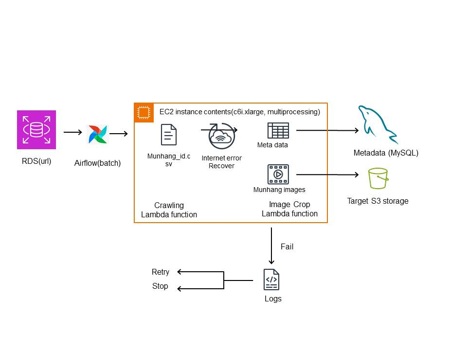

# chunjae_workbook_crwal_migrate_to_DB

시험지 이미지를 crwaling ->  image -> db로 옮기는 과정중 feature만 따로 github에 올립니다.
관련 주소 password 등은 없기 때문에 시연은 불가능할수 있지만 본인의 dummy data랑 aws address를 넣으면 돌아갈수있게 코딩할 예정입니다.

### Update log
07-11 ~ 12: crawling을 전체 화면 및 요소 캡쳐 방식으로 구현  
07-13: 기본적인 회사 codecommit 계정 배포 및 연결  
07-17: crawing 기능 추가 -> 문제 영역만 추출(이미지 편집으로 해결)  
07-18: db및 주소 관련 setting.py로 옮김(본 깃 허브에는 없습니다), AWS lambda에서 돌리기 위한 dockerfile 준비 및 검증 완료
07-25: svg 형식으로 전환및 lambda 이미지 가공  
08-18: ec2환경으로 변환, tmp파일 자동삭제 및 이미지 크롤링 실패시는 넘어가도록 설정, 단 인터넷 연결로 인한 문제 발생시에는 재실행 되도록 코드 수정
### Solution
1. Selenium 자동 업데이트 및 버전 문제
> 우선 바로 테스트하고 해결하기는 어려움이 있어서, (https://github.com/umihico/docker-selenium-lambda)의 이미지를 베이스로 해서 크롤링 및 db DML 기능을 구현  

> 그럼에도 기본적으로 (https://docs.aws.amazon.com/ko_kr/lambda/latest/dg/lambda-python.html) 본 사이트의 이벤트 처리 형식 (def, event..)를 따라야 함  

> 특히나 종속적인 라이브러리가 많은 본 프로젝트에서는 lambda에서 코딩하는 것보다는 docker file 자체를 AWS ECR에 배포, 그이후에 배포 이미지를 lambda에 연결하는 방식으로 구현(10기가 까지 가능하다는 것이 장점)

** AWS ECR (Elastic Container Registry)연결하기
https://ap-northeast-2.console.aws.amazon.com/ecr/repositories?region=ap-northeast-2

기본적으로 ECR을 쓰는 이유는 lambda에 docker image를 올리고 빼고하는게 귀찮기 떄문에  
버전관리를 위해서 사용 (docker 역활과 동일)

  1. AWS에서 IAM > 사용자 > 생성
  2. 보안정책은 AmazonEC2ContainerRegistryFullAccess Policy만 허용
  3. 보안자격증명에서 액세스키 생성
  4. ID, secretID 를  .csv저장
  5. docker가 깔려있는 환경 (wsl에 접속)
  6. apt-get install unzip 하기
  7. aws configure 입력하고 push할수 있는 계정 입력하기(user_credential확인)
  8. https://docs.aws.amazon.com/ko_kr/cli/latest/userguide/getting-started-install.html
  따라하기
  9. ECR 레포지 생성(꼭 private)
  10. push 명령어 호출
  11. 따라하시면 끗

  * 참고 https://bluese05.tistory.com/51

2. 보안정책 관련 문제
  1. lambda 권한 문제
     * 람다 자체에 우선 권한이 있어야 함.
       - AWSLambdaBasicExecutionRole
       - AWSLambdaRDSProxyExecutionRole
       - CloudWatchLogsFullAccess
       - AWSLambdaVPCAccessExecutionRole
       - AWSLambdaExecute
       를 부여하는 것을 추천 (필요하다면 그때 더 넣는 것을 추천한다
2. 보안정책 문제
  * 우선 db와 같은 서브넷 구조안에 있으면서, 인터넷이 연결되어있으면서, NAT게이트웨이 구조까지 있어야 가능함.

### 2023-08-18 Update

1. 우선 Lambda에서 실행자체는 성공했지만 비용자체가 너무 많이 발생(48만건 기준 거의 30~40만원.., 대신 10분안에 해결가능)
2. 따라서 ec2로 옮겨서 실행(즉 람다 전용으로 docker image 포맷할 필요가 없어짐)
3. 이 과정에서 chrome버전과 드라이버 버전을 고정함 (115) 현재는 116 최신버전이 나오긴했지만, 업데이트는 하지 않을 예정
4. 여기서 5만건 이상 진행시 tmp파일이 과도하게 쌓이는 현상이 발생함(이는 google.chrome으로 생기는 tmp파일로 추정됨)
5. 보안정책 문제는 해결함. NAT게이트웨이 구조로 간접적으로 인터넷이 되도록 함.
6. ec2의 경우 c6i.xlarge로 실행함. 다만 추후에 airflow로 배치 작업 실행시 필요한 용량이 5.5 기가이므로 이에 따라 용량 증설 필요

### 2023-09-12 Update

1. airflow에서 어차피 dockercompose로 올려야 하는데, 그 과정에서 chrome과 selenium은 자동업데이트, driver는 셀레니움이 알아서 다운받음
2. tmp과도하게 나오는 현상은 tmp경로 지정및 매번 삭제 해주는 것이 좋은걸루
3. c6i.xlarge로도 결국 부족해서 c6i.2xlarge 를 사용했음. 메모리 문제도 있지만, 배치 작업에서 너무 불리하며, 애초에 airflow가 최소 10기가 메모리를 요구
4. airflow는 dag로 실행되기떄문에 dag폴더에 py파일로 배치 작업을 실행 + 성공 및 실패시 email로 전송하게 작업함함
