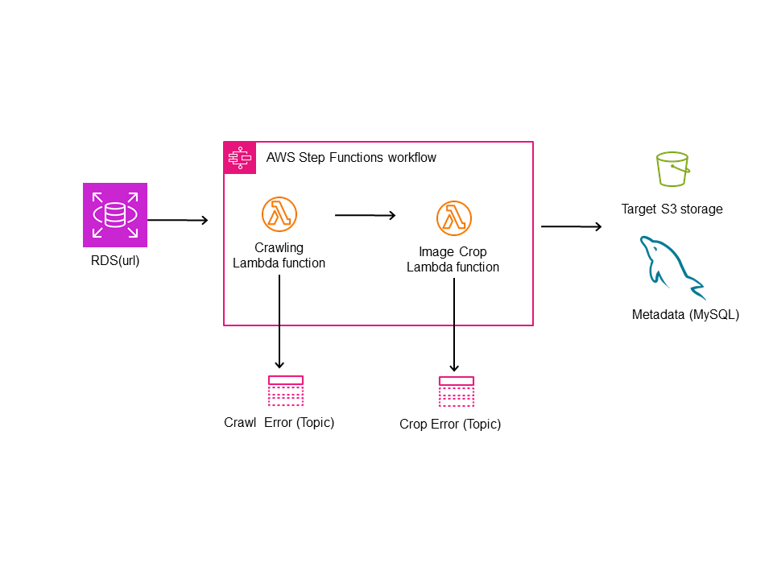

# chunjae_workbook_crwal_migrate_to_DB

시험지 이미지를 crwaling ->  image -> db로 옮기는 과정중 feature만 따로 github에 올립니다.
관련 주소 password 등은 없기 때문에 시연은 불가능할수 있지만 본인의 dummy data랑 aws address를 넣으면 돌아갈수있게 코딩할 예정입니다.

### Update log
07-11 ~ 12: crawling을 전체 화면 및 요소 캡쳐 방식으로 구현  
07-13: 기본적인 회사 codecommit 계정 배포 및 연결  
07-17: crawing 기능 추가 -> 문제 영역만 추출(이미지 편집으로 해결)
